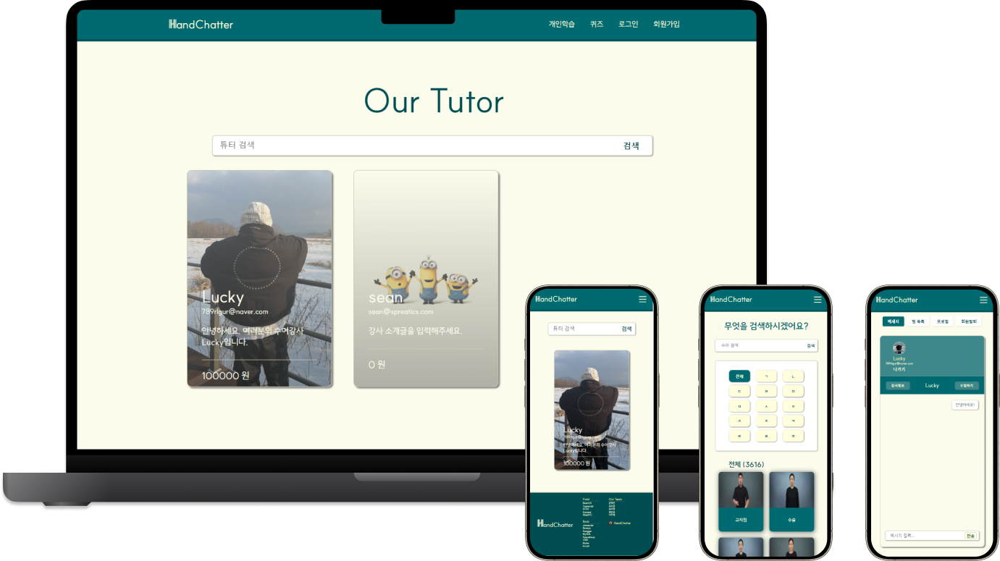
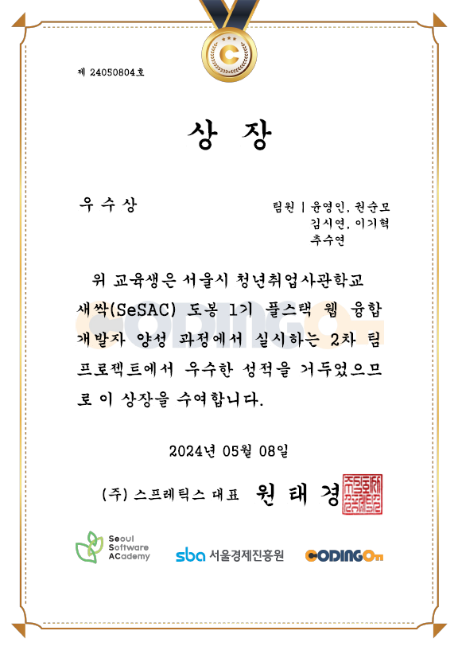

<div align="center">


## \<Hand Chatter>에서 내가 원하는 강사를 찾아 수어를 배워보세요!

팀 작업 규칙, 컨벤션, 산출물(ERD, FIGMA, API 리스트 등)은 [](https://github.com/purple11-11/HandChatter/wiki)를 확인해 주세요.

<br />



</div>

<br>

### 작업 기간 : 2024.04.19 ~ 2024.05.07 (약 2주 반)

### 팀원 소개

|                                                              윤영인(리더)                                                               |                                                                권순모                                                                |                                                               김시연                                                               |                                                                이기혁                                                                 |                                                                 추수연                                                                 |
| :-------------------------------------------------------------------------------------------------------------------------------------: | :----------------------------------------------------------------------------------------------------------------------------------: | :--------------------------------------------------------------------------------------------------------------------------------: | :-----------------------------------------------------------------------------------------------------------------------------------: | :------------------------------------------------------------------------------------------------------------------------------------: |
| <a href="https://github.com/purple11-11"></a> | <a href="https://github.com/Soonmo97"></a> | <a href="https://github.com/imooxo"></a> | <a href="https://github.com/leekihyeok"></a> | <a href="https://github.com/CHUSUEYEON"></a> |
|                                                            프론트엔드, 배포                                                             |                                                  풀스택 (1:1 채팅), <br /> DB 설계                                                   |                                                         풀스택 (화상 채팅)                                                         |                                                          디자인, 프론트엔드                                                           |                                                                 백엔드                                                                 |

<br>

## 시작 가이드

### Install

```
    $ git clone https://github.com/purple11-11/HandChatter.git
    $ cd HandChatter
```

### Client

```
    $ cd client
    $ npm install
    $ npm start
```

### Server

```
   $ cd server
   $ npm install
   $ npm run dev
```

<br>
<br>
<br>

# 🙌🏻 서비스 소개

<details align="center">
<summary style="font-size: 18px;"><b>🎉2차 팀프로젝트 우수상 수상작🎉</b></summary>
<div markdown="1">


</div>
</details>

## 1. 기획 의도

-   수어 API와 WebRTC 기술을 활용한 청각 장애인 일자리 창출
-   시간과 장소에 구애받지 않는 온라인 1:1 수어 학습 및 강의 플랫폼

## 2. 서비스 타겟

-   취미 생활 또는 일자리가 필요한 청각 장애인
-   수어를 배우고 싶은 사람
-   평소 수어에 관심이 있던 사람

<br>
<br>
<br>

# 🙌🏻 기능 소개

### 💻 시연 영상

https://github.com/purple11-11/HandChatter/assets/125553827/363011d6-6ad6-465f-8d5e-fbe93606b1f2

<br />

## 메인 페이지 : 강사 검색, 슬라이드(모바일)

-   강사의 이름으로 검색 가능.
-   강사 정보가 담긴 카드들을 모바일 환경에서 용이하게 볼 수 있도록 Vanilla JS로 슬라이드 구현.

## 로그인, 회원가입

-   학생은 일반 로그인, 카카오 로그인으로 서비스 이용
-   튜터는 회원 가입 시 증빙자료 첨부가 필수기 때문에 일반 로그인만 가능
-   Nodemailer를 통해 이메일 인증 및 비밀번호 찾기 기능에 활용

## 튜터 상세 페이지: 찜 하기, 리뷰

-   찜하기 클릭 시 로그인이 되어있지 않은 상태라면 알림메시지와 함께 로그인 창으로 가도록 구현, 로그인이 되어 있다면 찜 목록에 추가되었다는 알림메시지와 함께 실제로 찜 목록에 추가되고 화면에도 색이 채워진 하트로 표시되도록 구현.
-   해당 튜터의 리뷰 정보들 중 별점 정보를 api 요청을 통해받아와서 프론트에서 평균 처리 함.

## 마이페이지: 메시지, 찜목록, 프로필 수정, 회원 탈퇴

-   socket.io로 실시간 채팅이 되게 끔 구현, 또한 메시지를 보낼 시 서버의 DB에 저장되도록 하여 이전에 보낸 메시지들을 볼 수 있도록 했음.
-   소켓 아이디들을 소켓 서버 측에서 객체로 관리하여 한 명의 강사 뿐만 아니라 여러 강사와 채팅방(단 1:1 채팅방)을 만들고 나눌 수 있음.

## 수업하기: WebRTC, 채팅

-   WebRTC를 이용하여 비디오, 오디오에 접근해서 켜기, 끄기 등의 제어가 가능하며 상대방과 나의 화면을 직접적인 네트워크 연결 설정을 통해 실시간 비대면 화상채팅이 되도록 구현.
-   추가로 실시간 채팅을 함께 할 수 있도록 구현.

## 개인 학습

-   일상생활 수어 API로 받은 데이터로 카드 생성, 카드 클릭 시 학습할 수 있는 페이지로 이동
-   원하는 단어 검색 및 한글 초성 버튼으로 검색
-   각 순번 페이지와 맨 처음, 맨 끝으로 이동 가능한 Pagination

## 퀴즈

-   데이터를 섞어주는 shuffle 함수 생성 후 3616개의 수어 데이터 중 10문제 추출
-   만점 시 축하 문구가 적힌 결과 화면 나오고, "다시하기" 버튼을 통해 새로운 퀴즈 풀기 가능

## 관리자

-   .env 파일에 관리자 아이디, 비밀번호 작성해 관리자 로그인 API로 일치여부 확인 후 로그인
-   회원 가입한 예비튜터의 증빙 자료 확인 후 튜터로 권한 변경

<br />
<br />
<br />

# 🌱 개발 환경 및 사용 모듈

### Front-end

|                                                                          기술                                                                          | 사용 목적                                                                                                                                                                                      |
| :----------------------------------------------------------------------------------------------------------------------------------------------------: | :--------------------------------------------------------------------------------------------------------------------------------------------------------------------------------------------- |
|       | React는 사용자 인터페이스를 구축하기 위한 JavaScript 라이브러리. <br /> 컴포넌트 기반 아키텍처를 사용하여 코드의 재사용성과 유지 보수성을 높이고, 가상 DOM을 통해 성능을 최적화하기 위해 사용. |
|  | TypeScript는 JavaScript에 정적 타입을 도입하여 코드의 가독성을 높이고 디버깅을 쉽게 만들어주는 언어이며, 사이트 내에 여러 데이터들을 관리하기 위해 사용.                                       |
|                | Zustand는 React 상태 관리 라이브러리로, 간단한 API를 제공하여 상태 관리를 간편하게 만들어줌. <br /> 로그인, 회원 정보등의 상태를 전역적으로 관리하기 위해 사용.                                |
|          | SASS(.scss)는 CSS의 확장으로, 변수, 중첩 규칙, 믹스인 등을 제공하여 CSS의 유연성을 향상. 코드의 재사용성과 유지 보수성을 높여주며 페이지에 따라 중첩을 막기 위해 사용.                         |
|                                                                           | WebRTC는 웹 애플리케이션과 모바일 앱에서 실시간 통신을 위한 기술. 강사와 학생의 화상채팅을 위해 사용.                                                                                          |

<br />

### Back-end

|                                                                        기술                                                                         | 사용 목적                                                                                                                                                                                                                                                                                                                                                                                                                                                                                                                       |
| :-------------------------------------------------------------------------------------------------------------------------------------------------: | :------------------------------------------------------------------------------------------------------------------------------------------------------------------------------------------------------------------------------------------------------------------------------------------------------------------------------------------------------------------------------------------------------------------------------------------------------------------------------------------------------------------------------ |
|       | Node.js는 JavaScript 런타임 환경으로, 비동기적인 이벤트 주도 아키텍처를 통해 빠르고 확장 가능한 네트워크 애플리케이션을 개발.                                                                                                                                                                                                                                                                                                                                                                                                   |
|  | Express는 Node.js를 위한 웹 애플리케이션 프레임워크로, 라우팅, 미들웨어 등을 제공하여 웹 서버를 구축하는 데 도움이 됨.                                                                                                                                                                                                                                                                                                                                                                                                          |
|                                                               사용한 <br /> 외부 모듈                                                               | - `Bcrypt` : Bcrypt는 비밀번호 해싱 함수로, 사용자의 비밀번호를 안전하게 저장하기 위해 사용. <br /> - `Sequelize` : Sequelize는 Node.js를 위한 ORM(Object-Relational Mapping) 라이브러리로, 데이터베이스 쿼리와의 상호 작용을 추상화하여 개발자가 데이터베이스를 더 쉽게 사용 가능. <br /> - `Socket.io` : Socket.io는 웹 소켓을 위한 라이브러리로, 1:1 채팅에서 실시간 양방향 통신을 구현하는 데 사용. <br /> - `cross-env` : 여러 환경에서 동일한 환경 변수를 설정할 수 있도록 도와주는 도구로, 보안 및 구성 관리를 위해 사용 |
|    | MySQL은 관계형 데이터베이스 관리 시스템(RDBMS)으로, 구조화된 데이터를 저장하고 관리하는 데 사용.                                                                                                                                                                                                                                                                                                                                                                                                                                |
|  | Swagger는 API 문서를 작성하고 관리하기 위한 프레임워크로, 프론트엔드와 백엔드의 협업을 위해 API의 명세를 문서화하고 테스트 할 수 있도록 사용.                                                                                                                                                                                                                                                                                                                                                                                   |

<br />

### Deploy

|                                                                       기술                                                                        | 사용 목적                                                                                                                                                                                                                                                                                                                                                                                                                                                                                                                                                                                |
| :-----------------------------------------------------------------------------------------------------------------------------------------------: | :--------------------------------------------------------------------------------------------------------------------------------------------------------------------------------------------------------------------------------------------------------------------------------------------------------------------------------------------------------------------------------------------------------------------------------------------------------------------------------------------------------------------------------------------------------------------------------------- |
|    | AWS(Amazon Web Services)는 클라우드 컴퓨팅 플랫폼으로, 다양한 서비스를 제공하여 웹 애플리케이션을 운영하고 확장하는 데 사용. <br /> - `EC2` : EC2(Elastic Compute Cloud)는 AWS의 가상 서버 서비스로, 확장 가능한 컴퓨팅 리소스를 제공하여 애플리케이션을 실행하고 관리하는 데 사용. <br /> - `RDS` : RDS(Relational Database Service)는 AWS의 관리형 관계형 데이터베이스 서비스로, MySQL, PostgreSQL, Oracle 등의 데이터베이스를 쉽게 배포, 관리 가능. <br /> - `Route 53` : AWS의 DNS(도메인 이름 시스템) 웹 서비스로 도메인 등록, DNS 라우팅, 상태 확인을 조합하여 실행하기 위해 사용. |
|  | Nginx는 웹 서버 소프트웨어로, 로드 밸런싱, 리버스 프록시, 정적 파일 제공 등의 기능을 제공하여 웹 서버의 성능과 안정성을 향상.                                                                                                                                                                                                                                                                                                                                                                                                                                                            |
